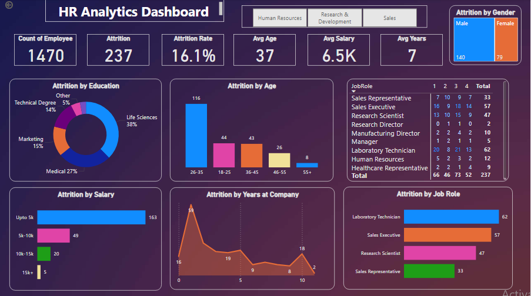

# Data Analytics Portfolio
# Project 1

**Title:** [Adidas US Interactive Sales Dashboard](https://github.com/FaithTiliki/Faithtiliki.github.io/blob/main/Copy%20of%20Adidas-Dashboard-START.xlsx)

**Tools Used:** Microsoft Excel(Pivot table, Pivot charts, Slicers, Timeline, Chart formatting, Data cleaning, Handling of missing values, handling duplicates and empty cells.)   

**Project Description:** This project involved analysing sales data of Adidas company to identify trends and patterns in retailers sales performance for 2020 & 2021. It is designed to provide a comprehensive overview of key performance metrics. This dashboard allows stakeholders to easily monitor and analyze the company’s performance across different regions, products, and time periods. The dashboard includes the following features:

Total Sales By Retailers: Visual representation of sales broken down by each adidas retailers in the year 2020 & 2021.

Total Units Sold by Sales Method: A breakdown of the total units sold by sales method, providing insights into the sales method that brings in more profit form the retailers over time.

Total Operating Profit By Region: Displays the total operating profit, allowing for easy comparison of profitability between regions where retailers are situated.

Total 5 cities by sales: Highlights the top 5 cities with the highest revenue. 

Total Unit sold by Products and retailers: Visualize the total unit of products sold by all retailers, showcasing their sales performance.

Additionally, the dashboard includes interactive slicers and timeline for:

Month: Filter the data to view performance for a specific month or range of months.

Region: Focus on specific countries to analyze regional performance.

Retailers: Filter the data to view performance of each adidas retailers. 

Product: Drill down into the performance of individual adidas products.

**Key findings:**

Sales Performance:

Top-performing retailers: Identify the retailers driving the highest sales.

Product Popularity: Determine the most popular product categories and specific products.

Regional Performance: Analyze the sales performance of different regions.

Sales Trends:

Seasonal Trends: Identify seasonal patterns in sales.

Year-over-Year Growth: Track the growth in sales over time.

Sales Channel Effectiveness:

Sales Method Performance: Evaluate the effectiveness of different sales channels (e.g., online, retail).

Potential Insights and Actions:

Targeted Marketing Campaigns: Focus marketing efforts on top-performing products and regions.

Inventory Management: Optimize inventory levels based on sales trends and demand forecasting.

Sales Channel Optimization: Identify opportunities to improve sales through different channels.

Customer Segmentation: Segment customers based on purchasing behavior and tailor marketing strategies accordingly.

Operational Efficiency: Identify areas where operational efficiencies can be improved to reduce costs.

By leveraging this interactive dashboard, Adidas can make data-driven decisions to optimize sales, improve customer satisfaction, and drive business growth.

**Dashboard Overview:**

# Project 2
**Title:** Employee Data Interrogation

**SQL Code:** [Employee Sql Queries](https://github.com/FaithTiliki/Faithtiliki.github.io/blob/main/Employee.sql)

**SQL Skills Used:** 

Data Retrieval (SELECT): Queried and extracted specific information from the database.

Data Aggregation (SUM, COUNT): Calculated totals, such as sales and quantities, and 
counted records to analyze data trends.

Data Filtering (WHERE, BETWEEN, OR, LIKE, AND): Applied filters to select relevant data, including filtering by ranges and lists.

Data Source Specification (FROM): Specified the tables used as data sources for retrieval

**Project Description:**

Objective:

To analyze employee data and extract valuable insights for decision-making and reporting purposes.

Data Sources:

Employee_Details table: Contains employee details like ID, name, city, manager ID, etc.

Employee_Salary table: Contains employee IDs, salaries, projects, and other relevant information.

Queries and Their Purposes:

Identifying Team Members:

Query: Fetches employees directly reporting to a specific manager.

Project Analysis:

Query 2: Identifies different projects undertaken by employees.

Query 3: Counts employees working on a specific project.

Salary Analysis:

Query 4: Calculates maximum, minimum, and average salaries.

Query 5: Identifies employees within a specific salary range.

Employee Filtering:

Query 6: Filters employees based on city and manager ID.

Query 7: Filters employees based on city or manager ID.

Query 8: Filters employees based on project exclusion.

Data Manipulation:

Query 9: Calculates the total salary for each employee by adding a variable value.

Query 10: Filters employees based on a specific pattern in their name.

Data Integration:

Query 11: Combines employee IDs from two tables to identify common employees.

Potential Use Cases:

HR Analytics: Analyzing employee demographics, salary trends, and performance metrics.

Project Management: Tracking project assignments and resource allocation.

Compensation Planning: Identifying salary ranges and potential disparities.

Talent Management: Identifying high-performing employees and potential successors.

Reporting: Generating reports on employee data for various purposes, such as regulatory compliance or strategic planning.

By executing these SQL queries, you can gain valuable insights into employee data, which can inform decision-making and drive strategic initiatives.

**Technology used:** SQL server

# Project 3

**Title:** [HR Analytics Dashboard](https://github.com/FaithTiliki/Faithtiliki.github.io/blob/main/HR%20Analytics%20Dashboard.pbix)

**Tools Used:** Microsoft PowerBI(Visualization, Interactivity, Data connectivity and Customizable visualization)
 
**Project Description:**

Objective:

To create an interactive dashboard that provides a comprehensive overview of HR analytics, enabling data-driven decision-making and strategic insights.

Data Sources:

The dashboard likely relies on data from various HR systems, including:

HR Information System (HRIS): Employee information, demographics, tenure, and performance data.

Payroll System: Salary, bonus, and compensation data.

Recruitment System: Applicant tracking, hiring, and onboarding data.

Dashboard Components:

The dashboard appears to include the following key components:

Key Performance Indicators (KPIs):

Count of Employees: Total number of employees in the organization.

Attrition: Number of employees who have left the organization.

Attrition Rate: Percentage of employees who have left the organization.

Average Age: Average age of employees.

Average Salary: Average salary of employees.

Average Years of Service: Average tenure of employees.

Charts and Visualizations:

Attrition by Gender: A pie chart showing the distribution of attrition by gender.

Attrition by Education: A pie chart showing the distribution of attrition by education level.

Attrition by Age: A bar chart showing the distribution of attrition by age group.

Attrition by Salary: A bar chart showing the distribution of attrition by salary range.

Attrition by Years at Company: A line chart showing the trend of attrition over time.

Attrition by Job Role: A bar chart showing the distribution of attrition by job role.

**Key findings:**

Identify High-Attrition Groups: Focus on specific demographics (e.g., age, gender, education) or job roles with higher attrition rates.

Analyze Trends: Track changes in attrition rates over time and identify potential causes.

Improve Employee Satisfaction: Address issues related to job satisfaction, compensation, and work-life balance to reduce voluntary turnover.

Strengthen Retention Strategies: Implement targeted retention strategies for key talent segments.

Optimize Recruitment and Onboarding: Improve the hiring process to attract and retain top talent.

**Potential Use Cases:**

HR Planning: Forecasting future workforce needs and planning for succession.

Performance Management: Identifying performance gaps and implementing targeted development plans.

Compensation and Benefits: Analyzing compensation trends and adjusting compensation packages to remain competitive.

Employee Engagement: Measuring employee satisfaction and implementing initiatives to improve morale.

This HR Analytics dashboard empowers organizations to make data-driven decisions that enhance workforce productivity and drive business success.

**Dashboard Overview:** 

