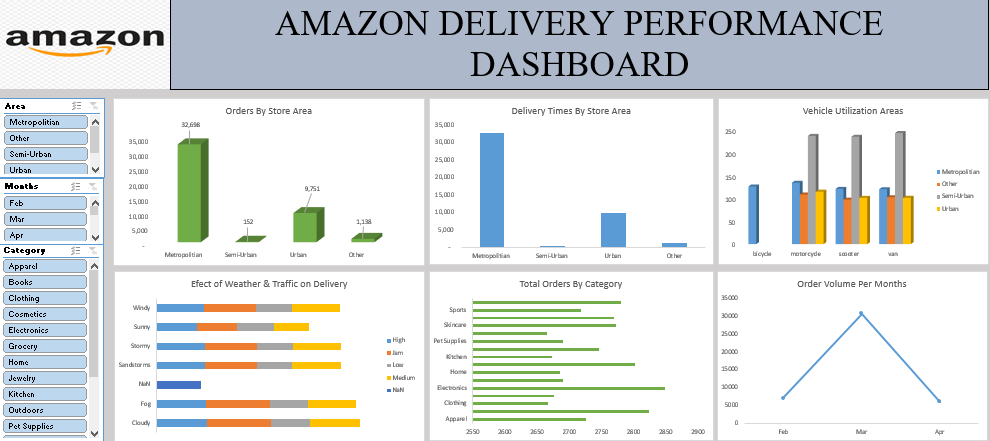

# Data Analytics Portfolio
# Project 1

**Title:** [Adidas US Interactive Sales Dashboard](https://github.com/FaithTiliki/Faithtiliki.github.io/blob/main/Copy%20of%20Adidas-Dashboard-START.xlsx)

**Tools Used:** Microsoft Excel(Pivot table, Pivot charts, Slicers, Timeline, Chart formatting and Data cleaning)   

**Project Description:** This project involved analysing sales data of Adidas company to identify trends and patterns in retailers sales performance for 2020 & 2021. It is designed to provide a comprehensive overview of key performance metrics. This dashboard allows stakeholders to easily monitor and analyze the company’s performance across different regions, products, and time periods. The dashboard includes the following features:

Total Sales By Retailers: Visual representation of sales broken down by each adidas retailers in the year 2020 & 2021.

Total Units Sold by Sales Method: A breakdown of the total units sold by sales method, providing insights into the sales method that brings in more profit form the retailers over time.

Total Operating Profit By Region: Displays the total operating profit, allowing for easy comparison of profitability between regions where retailers are situated.

Total 5 cities by sales: Highlights the top 5 cities with the highest revenue. 

Total Unit sold by Products and retailers: Visualize the total unit of products sold by all retailers, showcasing their sales performance.

Additionally, the dashboard includes interactive slicers and timeline for:

Month: Filter the data to view performance for a specific month or range of months.

Region: Focus on specific countries to analyze regional performance.

Retailers: Filter the data to view performance of each adidas retailers. 

Product: Drill down into the performance of individual adidas products.

**Key findings:**

Sales Performance:

Top-performing retailers: Identify the retailers driving the highest sales.

Product Popularity: Determine the most popular product categories and specific products.

Regional Performance: Analyze the sales performance of different regions.

Sales Trends:

Seasonal Trends: Identify seasonal patterns in sales.

Year-over-Year Growth: Track the growth in sales over time.

Sales Channel Effectiveness:

Sales Method Performance: Evaluate the effectiveness of different sales channels (e.g., online, retail).

**Potential Insights and Actions:**

Targeted Marketing Campaigns: Focus marketing efforts on top-performing products and regions.

Inventory Management: Optimize inventory levels based on sales trends and demand forecasting.

Sales Channel Optimization: Identify opportunities to improve sales through different channels.

Customer Segmentation: Segment customers based on purchasing behavior and tailor marketing strategies accordingly.

Operational Efficiency: Identify areas where operational efficiencies can be improved to reduce costs.

By leveraging this interactive dashboard, Adidas can make data-driven decisions to optimize sales, improve customer satisfaction, and drive business growth.

**Dashboard Overview:**

# Project 2
**Title:** Employee Data Interrogation

**SQL Code:** [Employee Sql Queries](https://github.com/FaithTiliki/Faithtiliki.github.io/blob/main/Employee.sql)

**SQL Skills Used:** 

Data Retrieval (SELECT): Queried and extracted specific information from the database.

Data Aggregation (MIN, MAX, AVG, COUNT): Calculated totals and counted records to analyze data.

Data Filtering (WHERE, BETWEEN, OR, LIKE, AND): Applied filters to select relevant data, including filtering by ranges and lists.

Data Source Specification (FROM): Specified the tables used as data sources for retrieval

**Project Description:**

Objective:

To analyze employee data and extract valuable insights for decision-making and reporting purposes.

Data Sources:

Employee_Details table: Contains employee details like ID, name, city, manager ID, etc.

Employee_Salary table: Contains employee IDs, salaries, projects, and other relevant information.

Queries and Their Purposes:

Identifying Team Members:

Query: Fetches employees directly reporting to a specific manager.

Project Analysis:

Query 2: Identifies different projects undertaken by employees.

Query 3: Counts employees working on a specific project.

Salary Analysis:

Query 4: Calculates maximum, minimum, and average salaries.

Query 5: Identifies employees within a specific salary range.

Employee Filtering:

Query 6: Filters employees based on city and manager ID.

Query 7: Filters employees based on city or manager ID.

Query 8: Filters employees based on project exclusion.

Data Manipulation:

Query 9: Calculates the total salary for each employee by adding a variable value.

Query 10: Filters employees based on a specific pattern in their name.

Data Integration:

Query 11: Combines employee IDs from two tables to identify common employees.

Potential Use Cases:

HR Analytics: Analyzing employee demographics, salary trends, and performance metrics.

Project Management: Tracking project assignments and resource allocation.

Compensation Planning: Identifying salary ranges and potential disparities.

Talent Management: Identifying high-performing employees and potential successors.

Reporting: Generating reports on employee data for various purposes, such as regulatory compliance or strategic planning.

By executing these SQL queries, you can gain valuable insights into employee data, which can inform decision-making and drive strategic initiatives.

**Technology used:** SQL server

# Project 3

**Title:** [HR Analytics Dashboard](https://github.com/FaithTiliki/Faithtiliki.github.io/blob/main/HR%20Analytics%20Dashboard.pbix)

**Tools Used:** Microsoft PowerBI(Visualization, Interactivity, Data connectivity and Customizable visualization)
 
**Project Description:**

Objective:

To create an interactive dashboard that provides a comprehensive overview of HR analytics, enabling data-driven decision-making and strategic insights.

Data Sources:

The dashboard likely relies on data from various HR systems, including:

HR Information System (HRIS): Employee information, demographics, tenure, and performance data.

Payroll System: Salary, bonus, and compensation data.

Recruitment System: Applicant tracking, hiring, and onboarding data.

Dashboard Components:

The dashboard appears to include the following key components:

Key Performance Indicators (KPIs):

Count of Employees: Total number of employees in the organization.

Attrition: Number of employees who have left the organization.

Attrition Rate: Percentage of employees who have left the organization.

Average Age: Average age of employees.

Average Salary: Average salary of employees.

Average Years of Service: Average tenure of employees.

Charts and Visualizations:

Attrition by Gender: A pie chart showing the distribution of attrition by gender.

Attrition by Education: A pie chart showing the distribution of attrition by education level.

Attrition by Age: A bar chart showing the distribution of attrition by age group.

Attrition by Salary: A bar chart showing the distribution of attrition by salary range.

Attrition by Years at Company: A line chart showing the trend of attrition over time.

Attrition by Job Role: A bar chart showing the distribution of attrition by job role.

**Key findings:**

Identify High-Attrition Groups: Focus on specific demographics (e.g., age, gender, education) or job roles with higher attrition rates.

Analyze Trends: Track changes in attrition rates over time and identify potential causes.

Improve Employee Satisfaction: Address issues related to job satisfaction, compensation, and work-life balance to reduce voluntary turnover.

Strengthen Retention Strategies: Implement targeted retention strategies for key talent segments.

Optimize Recruitment and Onboarding: Improve the hiring process to attract and retain top talent.

**Potential Use Cases:**

HR Planning: Forecasting future workforce needs and planning for succession.

Performance Management: Identifying performance gaps and implementing targeted development plans.

Compensation and Benefits: Analyzing compensation trends and adjusting compensation packages to remain competitive.

Employee Engagement: Measuring employee satisfaction and implementing initiatives to improve morale.

This HR Analytics dashboard empowers organizations to make data-driven decisions that enhance workforce productivity and drive business success.

**Dashboard Overview:** 

# Project 4

**Title:** [Amazon Interactive Delivery Performance Dashboard](https://github.com/FaithTiliki/Faithtiliki.github.io/blob/main/amazon_delivery%20Dashboard.xlsx)

**Tools Used:** Microsoft Excel(Data Cleaning, Slicers, Conditional formatting, Pivot table, Pivot charts, using formulars)

**Project Description:**

Objective:

The primary goal of this dashboard is to provide a comprehensive overview of Amazon's delivery performance, enabling data-driven decision-making and operational improvements.

Data Sources:

The dashboard likely relies on data from various sources, including:

Order Management System: Information on orders, products, quantities, and delivery addresses.

Logistics System: Data on shipping methods, carrier performance, and delivery times.

Weather Data: Real-time weather information to analyze its impact on deliveries.

Dashboard Components:

The dashboard appears to include the following key components:

Filters:

Area: Allows users to filter data by geographic area (e.g., Metropolitan, Other, Semi-Urban, Urban).

Months: Filters data by specific months.

Category: Filters data by product category.

Key Performance Indicators (KPIs):

Orders by Store Area: Shows the number of orders processed by different store areas.

Delivery Times by Store Area: Visualizes the average delivery time for each store area.

Vehicle Utilization by Area: Displays the utilization of vehicles in different areas.

Total Orders by Category: Shows the total number of orders for each product category.

Order Volume per Month: Tracks the trend of order volume over time.

Charts and Visualizations:

Bar Charts: Used to compare metrics across different categories or time periods.

Line Chart: Shows the trend of order volume over time.

Stacked Bar Chart: Visualizes the impact of weather and traffic on delivery times.

**Key findings:**

Identify Bottlenecks: Pinpoint areas with long delivery times or low vehicle utilization.

Optimize Delivery Routes: Analyze delivery routes to minimize travel time and fuel consumption.

Improve Weather and Traffic Impact Analysis: Develop strategies to mitigate the impact of adverse weather conditions and traffic congestion.

Enhance Inventory Management: Optimize inventory levels to ensure product availability and reduce stockouts.

Monitor Seasonal Trends: Analyze seasonal variations in order volume to adjust staffing and resources accordingly.

Customer Satisfaction: Track customer satisfaction metrics and identify areas for improvement in delivery speed and accuracy.

Amazon can gain valuable insights into its delivery operations, optimize performance, and enhance customer satisfaction by using this dashboard

**Dashboard Overview:**

# Project 5
**Title:** Employees Data Interrogation 2

**SQL Code:** [Employee Info Queries](https://github.com/FaithTiliki/Faithtiliki.github.io/blob/main/Employee%20Info%20Sql%20Queries)

**SQL Skills Used:**

Data Retrieval (SELECT): Queried and extracted specific information from the database.

Data Aggregation (SUM, COUNT, MIN, MAX, AVG): Used to count the number of rows in a specific group or the entire table, to find the maximum value in a specific column, to find the minimum value in a specific column and to calculate the average value of a specific column.

Data Filtering (WHERE, BETWEEN, IN, LEFT, ORDERBY, GROUPBY, AND): Applied filters to select relevant data, including filtering by ranges and lists.

Data Source Specification (FROM): Specified the tables used as data sources for retrieval

**Project Description:**

Objective:

To analyze employee data and extract valuable insights for decision-making and reporting purposes.

Data Sources:

The analysis is based on two tables:

Employee_Details: Contains employee details like ID, name, city, manager ID, department, etc.

Employee_Salary: Contains employee IDs, salaries, projects, and other relevant information.
Queries and Their Purposes:

Data Extraction and Formatting:

Query 1: Extracts employee first names in uppercase.

Query 4: Extracts the first four characters of employee last names.

Query 5: Extracts the city name from the address column.

Query 10: Concatenates first and last names into a full name.

Data Filtering and Counting:

Query 2: Counts employees in a specific department.

Query 7: Filters employees based on salary range.

Query 8: Filters employees based on name patterns.

Query 11: Counts employees by gender within a specific date range.

Query 14: Excludes specific employees from the query.

Query 15: Filters employees based on address.

Query 16: Identifies employees in managerial positions.

Query 18: Filters employees based on gender and department.

Data Sorting and Ranking:

Query 9: Retrieves the top N salaries.

Query 12: Sorts employees by last name and department.

Data Transformation and Aggregation:

Query 6: Creates a new table with filtered data.

Query 17: Counts employees by department and sorts by count.

Query 19: Identifies employees with a date of joining (potentially redundant).

Query 20: Finds the top and bottom salaries.

**Potential Use Cases:**

HR Analytics: Analyzing employee demographics, salary trends, and performance metrics.

Project Management: Tracking project assignments and resource allocation.

Compensation Planning: Identifying salary ranges and potential disparities.

**Technology used:** SQL server

# Project 6

**Title:** Pizza Sales Data Interrogation

SQL Code: [Piza Sales Data Queries](https://github.com/FaithTiliki/Faithtiliki.github.io/blob/main/Pizza%20Sales%20Sql)

**SQL Skills Used:**

Data Retrieval (SELECT): Queried and extracted specific information from the database.

Data Source Specification (FROM): Specified the tables used as data sources for retrieval

Data Aggregation (SUM, COUNT): Calculated totals, such as sales and quantities, and counted records to analyze data trends.

Data Filtering (WHERE): Applied filters to select relevant data.

Comparison Operators:
=: Equal to

Greater than (>)

BETWEEN: Within a range

Logical Operators:

AND: Combines multiple conditions.

OR: Combines multiple conditions.

IN: Checks if a value is in a list of values.

Date and Time Functions: Used to filter data based on specific date ranges.

**Project Description:**

Project Objective:
To analyze sales data from a pizza restaurant to gain insights into sales trends, customer preferences, and revenue performance.

Data Source:
A SQL database named [dbo].[pizza_sales].

Key Questions to Answer:

Overall Performance:

What is the total revenue generated?

How many pizzas were sold in total?

How many orders were placed?

Product Performance:

Which pizza category (e.g., Veggie, Meat) is the most popular?

Which specific pizza types (e.g., The Hawaiian Pizza, The Greek Pizza) are the best-sellers?

What is the sales quantity of a specific pizza (e.g., The Spinach Pesto Pizza) in a particular month?

Sales Trends:

What were the best-selling pizzas in a specific month (e.g., January 2015)?

What were the best-selling pizzas in a specific quarter (e.g., Q4 2015)?

Customer Preferences:

What are the most popular pizza sizes (e.g., Small, Medium, Large)?

Which pizzas are the most expensive?

Expected Outcomes:

By analyzing the data, we can identify trends, opportunities, and areas for improvement. This information can be used to optimize menu offerings, pricing strategies, and marketing campaigns.

**Technology used:** SQL server

# Project 7

**Title:** Football Players Data Interrogarion

**SQL Code:** [Football Players Data Queries](https://github.com/FaithTiliki/Faithtiliki.github.io/blob/main/Footbal%20Players%20Data.Sql)

**SQL Skills Used:**

Data Retrieval (SELECT): Queried and extracted specific information from the database.

Data Source Specification (FROM): Specified the tables used as data sources for retrieval

Data Aggregation (MAX,COUNT, MIN, AVG): Finds the maximum value in a column, Counts the number of rows or non-null values in a column, Finds the minimum value in a column and Calculates the average value in a column. 

Data Filtering (WHERE, GROUPBY): Applied filters to select relevant data, also used to group rows based on one or more columns.

Comparison Operators:
=: Equal to

Greater than (>)

BETWEEN: Within a range

Logical Operators:

AND: Combines multiple conditions.

OR: Combines multiple conditions.

IN: Checks if a value is in a list of values.

Advanced SQL Skills

Window Functions:

RANK: Assigns a rank to each row within a partition.

Subqueries: Used to embed one query within another to filter or aggregate data.

Joins: While not explicitly used in these queries, joins can be used to combine data from multiple tables.

Common Table Expressions (CTEs): Can be used to simplify complex queries and improve readability.

CASE Statement: Used to conditionally assign values to a new column.

**Project Description:**

Project Goal:
To analyze a dataset of football player information to gain insights into player performance, team dynamics, and potential trends.

Data Source:
A SQL database named [dbo].['Football Players Data'].

Key Questions to Answer:

Player Performance:

Who are the heaviest players in each position?

How are players ranked by age within their team?

What is the average height of players older than 25?

Who are the tallest and shortest players from each college?

Who are the players with the minimum height for each position?

Team Dynamics:

How many players are there for each team, grouped by experience level?

What is the percentage of players in each position for every team?

Player Comparisons:

Who are the players whose height is greater than the average height of their team?

Who are the players whose weight is above the average weight for their position?

Data Cleaning and Transformation:

Can we categorize players based on age (e.g., Young, Middle-Aged, Old)?

Can we standardize college names (e.g., map "Alabama" to "University of Alabama")?

Potential Outcomes:

We can identify trends, outliers, and potential correlations by analyzing this data. This information can be used for player scouting, team building, and strategic decision-making. Additionally, the analysis can help in understanding player performance metrics and identifying areas for improvement.

**Technology used:** SQL server

# Project 8
**Title:** Customer & Sales Data Interrogation

**SQL Code:** [Customer & Sales Data Queries](https://github.com/FaithTiliki/Faithtiliki.github.io/blob/main/Customer%20%26%20Sales%20Data.Sql)

**SQL Skills Used:**

Data Retrieval (SELECT): Queried and extracted specific information from the database.

Data Source Specification (FROM): Specified the tables used as data sources for retrieval

Data Aggregation (SUM, COUNT): Calculated totals, such as sales and quantities, and counted records to analyze data trends.

Data Filtering (WHERE): Applied filters to select relevant data.

Comparison Operators:
=: Equal to

Greater than (>)

BETWEEN: Within a range

Logical Operators:

AND: Combines multiple conditions.

OR: Combines multiple conditions.

IN: Checks if a value is in a list of values.

Date and Time Functions: Used to filter data based on specific date ranges.

**Project Description:**

Project Objective:

To analyze sales data from a company to gain insights into sales performance, customer behavior, and identify potential areas for improvement.

Data Sources:

Salesman Table: Contains information about salespeople, including their names, cities, and commission rates.

Customer Table: Contains information about customers, including their names, cities, grades, and assigned salespeople.

Order Table: Contains information about orders, including order numbers, dates, amounts, customer IDs, and salesperson IDs.
Key Questions to Answer:

Sales Performance Analysis:

Which salespeople have the highest commissions?

Are there any trends in sales performance over time?

What is the average order value for each salesperson?

Customer Analysis:

Which customers have placed the most orders?

What is the average order value for each customer?

Are there any customers who have not placed orders recently?

Salesperson-Customer Relationships:

Which salespeople have the most customers?

Are there any salespeople who are not assigned to any customers?

Are there any customers who have not been assigned to a salesperson?

Sales and Customer Trends:

Are there any seasonal trends in sales?

Are there any specific customer segments that generate the most revenue?

Are there any geographic patterns in sales performance?

Expected Outcomes:

By analyzing the data, we can:

Identify top-performing salespeople and reward them accordingly.

Identify underperforming salespeople and provide additional training or support.

Identify high-value customers and target them with personalized offers.

Identify potential new customer segments.

Optimize sales and marketing strategies to increase revenue.

Specific Use Cases:

Sales Management: Use the analysis to identify top-performing salespeople and reward them accordingly.

Customer Relationship Management: Use the analysis to identify high-value customers and target them with personalized offers.

Marketing: Use the analysis to identify potential new customer segments and target them with marketing campaigns.

Operational Efficiency: Use the analysis to identify inefficiencies in the sales process and implement improvements.

**Technology used:** SQL server

# Project 9

**Title:** Student Performance Data Interrogation

**SQL Code:** [Student Performance Data Sql Queries](https://github.com/FaithTiliki/Faithtiliki.github.io/blob/main/Student%20Performance.%20Sql)

**SQL Skills Used:**

Data Retrieval (SELECT): Queried and extracted specific information from the database.

Data Source Specification (FROM): Specified the tables used as data sources for retrieval

Data Aggregation (Max, COUNT): Finds the maximum value in a column and Counts the number of rows or non-null values in a column.

Data Filtering (WHERE): Applied filters to select relevant data.

GROUP BY Clause: Used to group rows based on one or more columns.

ORDER BY Clause: Sorts the result set based on specified columns.

TOP Clause: Limits the number of rows returned.

Advanced SQL Skills
CASE Statement: Used to conditionally assign values to a new column.

**Project Description:**

Project Objective:

To analyze student performance data to gain insights into student achievement, identify trends, and inform educational strategies.

Data Source:

A SQL database named [dbo].[Cleaned_Students_Performance].

Key Questions to Answer:

Overall Performance:

What is the highest total score achieved by any student?

What are the highest scores in each subject (Math, Reading, Writing)?

What is the distribution of average scores among students?

Performance by Gender:
Which gender tends to have higher total scores?

Performance by Race/Ethnicity:

Which racial/ethnic group tends to have the highest total scores?

Impact of Test Preparation Course:

How does the completion of a test preparation course impact student performance?

Expected Outcomes:

By analyzing the data, we can:

Identify High-Performing Students: Recognize students who consistently excel in multiple subjects.

Identify Areas for Improvement: Determine specific subjects or skills where students may need additional support.

Evaluate the Effectiveness of the Test Preparation Course: Assess whether the course positively impacts student performance.

Inform Educational Policies: Use the insights to develop targeted interventions and strategies to improve student outcomes.

Potential Use Cases:

Student Support: Identify students who may need additional tutoring or academic support.

Curriculum Development: Evaluate the effectiveness of current curriculum and identify areas for improvement.

Teacher Professional Development: Provide teachers with data-driven insights to inform their instructional practices.

Resource Allocation: Allocate resources to schools and programs that have demonstrated positive impacts on student achievement.

**Technology used:** SQL server

# Project 10

**Title:** [Student Performance Interactive Dashboard](https://github.com/FaithTiliki/Faithtiliki.github.io/blob/main/Student%20Performance%20Dashboard.pbix)

**Tools Used:** Microsoft Powerpoint (Visualization, Colour Scheme and Interactivity)

**Project Description:** 

Project Goal:

To create a visual dashboard that provides a comprehensive overview of student performance data, enabling data-driven insights into student achievement, identify trends, and inform educational strategies.

Data Source:

A SQL database containing student performance data which include;

Student demographics (e.g., gender, race/ethnicity, parental level of education)

Test scores (e.g., math, reading, writing)

Test preparation course completion status

Dashboard Components and Insights:

Total Number of Students: A simple metric displaying the overall number of students in the dataset.

Average Score by Gender: A pie chart showing the average score for male and female students. This helps identify potential gender-based performance disparities.

Total Score by Gender: A bar chart comparing the total scores of male and female students. This provides a more granular view of performance differences.

Average Score of Math, Reading, and Writing by Gender: A bar chart comparing the average scores of male and female students in each subject. This helps identify subject-specific performance differences.

Average Score of Math, Reading, and Writing by Parental Level of Education: A bar chart comparing the average scores of students whose parents have different levels of education. This helps identify the impact of parental education on student achievement.

Average Score of Reading and Writing by Parental Level of Education: A bar chart comparing the average reading and writing scores of students whose parents have different levels of education. This helps identify the impact of parental education on specific subject areas.

Average Score of Math by Parental Level of Education: A bar chart comparing the average math scores of students whose parents have different levels of education. This helps identify the impact of parental education on math achievement.

Average Score of Reading and Writing by Race/Ethnicity: A bar chart comparing the average reading and writing scores of students from different racial/ethnic groups. This helps identify potential racial/ethnic disparities in performance.

**Key findings and Insights:**

Identify Performance Gaps: By comparing scores across different demographics, educators can identify areas where students may be struggling.

Inform Instructional Strategies: The data can help inform instructional strategies and target interventions to address specific needs.

Evaluate the Impact of Parental Education: The dashboard can help assess the impact of parental education on student achievement.

Monitor Student Progress: By tracking performance over time, educators can monitor student progress and identify trends.

Resource Allocation: The data can help inform resource allocation decisions, such as allocating additional support to struggling students or schools.

**Dashboard Overview:**

# Project 11

**Title:** Food Supply Data Interrogation

**SQL Code:** [Food Supply Data Sql Queries](https://github.com/FaithTiliki/Faithtiliki.github.io/blob/main/Food%20Supply.%20Sql)

**SQL Skills Used:**

The provided SQL queries demonstrate a solid foundation in SQL, particularly in the context of data analysis and retrieval from a database named [dbo].['Food supply']. Specific skills utilized:

Fundamental SQL Skills

SELECT Statement: The core of all queries, used to retrieve specific columns from the table.

FROM Clause: Specifies the table involved in the query.

WHERE Clause: Used to filter rows based on specific conditions, though not explicitly used in these queries.

GROUP BY Clause: Used to group rows based on one or more columns.

ORDER BY Clause: Sorts the result set based on specified columns.

Aggregate Functions:

COUNT: Counts the number of rows or non-null values in a column.

SUM: Calculates the sum of a numeric column.

DISTINCT Keyword: Used to eliminate duplicate values.

Advanced SQL Skills

HAVING Clause: Used to filter groups created by the GROUP BY clause.

TOP Clause: Limits the number of rows returned.

**Project Description:**

Project Goal:

To analyze food supply chain data to gain insights into sales performance, product popularity, and regional trends.

Data Source:

A SQL database named [dbo].['Food supply$'].

Key Questions to Answer:

Product Analysis:

How many different products does the company sell?

What are the different product categories available?

What are the top 3 best-selling product categories?

What are the total sales for specific products like carrots, potato chips, and chocolate chips?

Regional Analysis:

Which city has the highest sales?

What are the total sales for each region?

What are the total sales for specific cities like Boston and New York?

What are the total sales for a specific region like the West region?

Expected Outcomes:

By analyzing the data, we can:

Identify Top-Performing Products: Determine the most popular products and categories.

Optimize Inventory Management: Identify slow-moving and fast-moving products to optimize inventory levels.

Identify High-Performing Regions: Identify regions with high sales potential for targeted marketing efforts.

Inform Business Decisions: Use the insights to make informed decisions about product assortment, pricing, and marketing strategies.

Potential Use Cases:

Product Strategy: Use the analysis to identify opportunities for product innovation and discontinuation.

Marketing Strategy: Target marketing efforts to specific regions or customer segments.

Supply Chain Optimization: Optimize the supply chain to ensure efficient delivery of products.

Financial Planning: Forecast future sales and revenue based on historical data.

**Technology used:** SQL server

